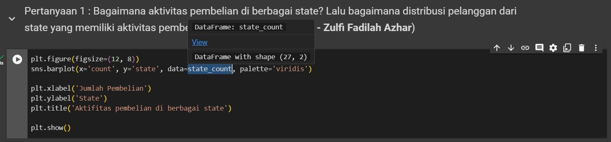

# Panduan import dataset
1. Buka project [Google Collab](https://drive.google.com/file/d/176BoMntRsELM4WoKus1Z18BtHTy-gIUO/view?usp=sharing)
2. Export dataframe terakhir yang sudah melalui tahap cleaning data. Sebagi contoh, dalam visualisasi ini menggunakan dataframe `state_count`



```python
# export dataframe tersebut menjadi csv
state_count.to_csv('zulfi-state_count.csv', index=False)
```

3. Download dan masukkan ke folder ini.
4. Import dataset ke pages

```python
import pandas as pd
import streamlit as st

state_count = pd.read_csv('dataset/zulfi-state_count.csv')
```

5. Cek dataframe apakah sudah berhasil di import atau belum

```python
st.dataframe(state_count)
```

6. Jalankan Streamlit di terminal

```bash
streamlit run 📊_Dashboard.py
```